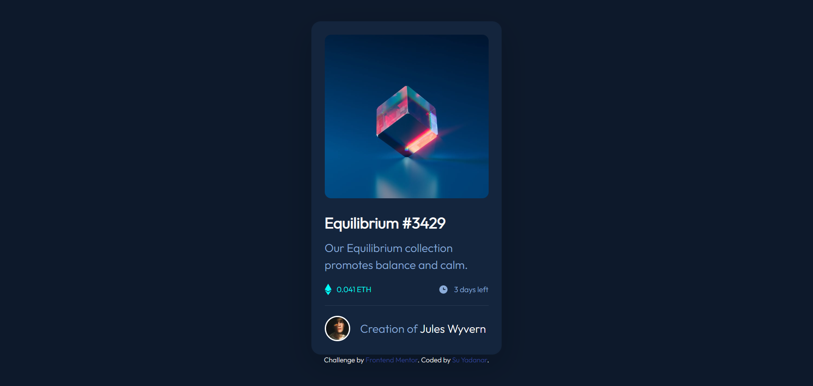

# Frontend Mentor - NFT preview card component solution

This is a solution to the [NFT preview card component challenge on Frontend Mentor](https://www.frontendmentor.io/challenges/nft-preview-card-component-SbdUL_w0U). Frontend Mentor challenges help you improve your coding skills by building realistic projects. 

## Table of contents

- [Overview](#overview)
  - [The challenge](#the-challenge)
  - [Screenshot](#screenshot)
  - [Links](#links)
- [My process](#my-process)
  - [Built with](#built-with)
  - [What I learned](#what-i-learned)
  - [Useful resources](#useful-resources)
- [Author](#author)

## Overview

### The challenge

Users should be able to:

- View the optimal layout depending on their device's screen size
- See hover states for interactive elements

### Screenshot



### Links

- Solution URL: [URL here](https://www.frontendmentor.io/solutions/nft-preview-card-component-using-html-custom-css-and-bootstrap-RMgOlYiTFc)
- Live Site URL: [URL here](https://nft-preview-card-component-wine-iota.vercel.app/)

## My process

### Built with

- HTML5
- CSS custom properties
- Bootstrap V4.6.1

### What I learned

I have learnt how to add overlay to images on hover.

```html
<div class="container d-flex p-0">
  
  
  <div class="overlay"></div>

  
</div>
```
```css
.container .overlay{
	position: absolute;
	top: 0;
	bottom: 0;
	left: 0;
	right: 0;

	background-color: var(--cyan);

	opacity: 0;
	transition: 1s ease;
}

.container .overlay-img{
	position: absolute;
	display: none;
}

.container:hover .overlay{
	opacity: 0.5;
}

.container:hover .overlay-img{
	display: block;
}
```

### Useful resources

- [How TO - Image Hover Overlay](https://www.w3schools.com/howto/howto_css_image_overlay.asp) - This helped on how to add overlay on image.

## Author

- GitHub - [SYadanar](https://github.com/SYadanar)
- Frontend Mentor - [@SYadanar](https://www.frontendmentor.io/profile/SYadanar)
